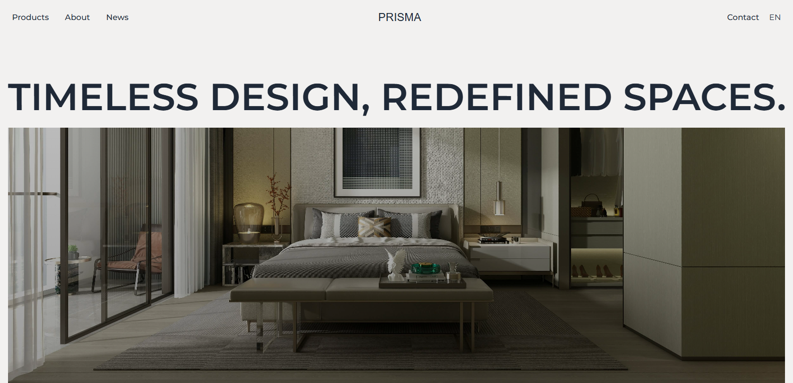

# Description

## **🏛️ Next.js Smooth Scroll Architecture Website**

This project is a modern, fully **responsive** architecture website **built with Next.js**, leveraging its powerful features for **server-side rendering** and **optimized performance**. Designed to showcase the elegance of architectural designs, the page provides an engaging and immersive experience with **smooth scrolling** powered by the Lenis library and dynamic animations using **ScrollReveal**.

The **minimalist design** highlights architectural elements while ensuring seamless navigation and usability. The site adapts perfectly to screens of all sizes, making it ideal for presenting projects on any device.

# **🛠️ Main Features**
- **Next.js Framework**
- **Lenis Smooth Scroll**
- **ScrollReveal Animations**
- **Responsive Design**
- **Modern UI/UX Design**

# **📷 Screenshots**

